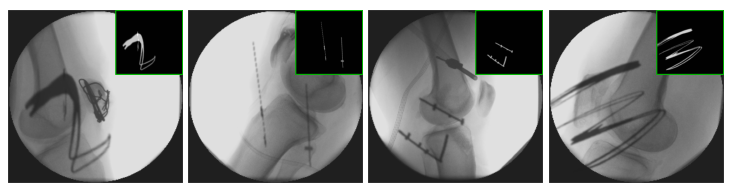

# Font Augmentation: Implant and Surgical Tool Simulation for X-Ray Image Processing

## Updates
- *01/2019*: Added initial code version. 

## Paper


_Font Augmentation: Implant and Surgical Tool Simulation for X-Ray Image Processing_

**Florian Kordon**,  Andreas Maier, Benedict Swartman, Holger Kunze
  Workshop Bildverarbeitung für die Medizin (BVM), 2020 (**Oral**)

If you find this code useful for your research, please cite our paper:

```
@InProceedings{kordon2020fontaug,
  author="Kordon, Florian and Maier, Andreas and Swartman, Benedict and Kunze, Holger",
  title="Font Augmentation: Implant and Surgical Tool Simulation for X-Ray Image Processing",
  booktitle="Bildverarbeitung f{\"u}r die Medizin 2020",
  year="2020",
  publisher="Springer Fachmedien Wiesbaden",
  address="Wiesbaden"
}
```

## Abstract
This study investigates a novel data augmentation approach for simulating surgical instruments, tools, and implants by image composition with transformed characters, numerals, and abstract symbols from open-source fonts. We analyse its suitability for the common spatial learning tasks of multi-label segmentation and anatomical landmark detection. The proposed technique is evaluated on 38 clinical intra-operative X-ray images with a high occurrence of objects overlaying the target anatomy. We demonstrate increased robustness towards superimposed surgical objects by incorporating our technique and provide an empirical rationale about the neglectable influence of realistic object shape and intensity information.

## Installation
The provided code got several dependencies which must be installed prior to using it:

* Python 3.6
* numpy 1.17.4
* scikit-image 0.16.2
* Pillow 6.2.1
* opencv-python 4.1.2
* imgaug 0.3.0
* (matplotlib for vizualization)

For testing the provided framework please use [run.py](run.py) with option 'example' set to **True** and provide at least one font file with '.ttf' or '.otf' file format.

## Acknowledgements
- The authors gratefully acknowledge funding of the Erlangen Graduate School in Advanced Optical Technologies (SAOT) by the German Research Foundation (DFG) in the framework of the German excellence initiative.
- The provided FontAugmentation implements the Augmenter API by [imgaug](https://github.com/aleju/imgaug).


## License
Font Augmentation is released under the [GNU General Public License v3.0](./LICENSE).
